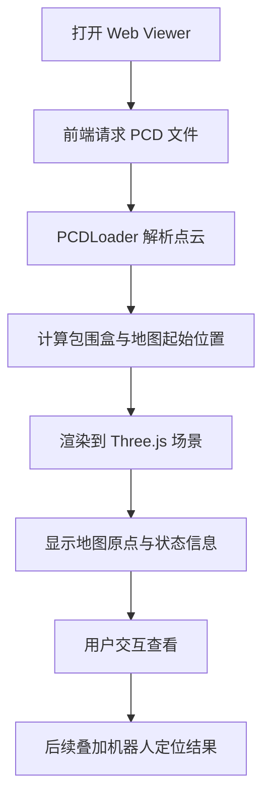

## 1. 产品概述
本项目提供一个最小可用的 Web PCD Viewer，用于在浏览器中加载并查看本地工作区内的 `.pcd` 点云文件。
- 目标是替代静态截图方式，提供旋转、缩放、平移、顶视角切换等基础交互能力，便于快速检查点云整体结构。
- 产品价值是降低点云调试和查看门槛，在无需安装专门桌面软件的情况下完成基础可视化。

## 2. 核心功能

### 2.1 功能模块
1. **查看器主页**：场景画布、工具栏、状态栏、帮助提示、地图坐标信息。

### 2.2 页面详情
| 页面名称 | 模块名称 | 功能描述 |
|-----------|-------------|---------------------|
| 查看器主页 | 顶部工具栏 | 显示标题、当前文件名、重置视角、切换顶视角、背景切换 |
| 查看器主页 | 3D 点云画布 | 加载并显示 PCD 点云，保留原始地图坐标系，支持鼠标旋转、缩放、平移 |
| 查看器主页 | 参数控制区 | 调节点大小、切换坐标轴/网格、显示点数、包围盒与地图起始位置 |
| 查看器主页 | 状态反馈区 | 显示加载中、加载成功、加载失败等状态 |
| 查看器主页 | 帮助信息区 | 显示鼠标操作说明和性能提示 |
| 查看器主页 | 定位预留区 | 展示机器人位姿占位信息，为后续接入机器人定位做准备 |

## 3. 核心流程
用户打开页面后，前端自动请求指定的 `.pcd` 文件，解析成功后将点云以原始地图坐标加入 3D 场景，并计算包围盒、地图起始位置和地图原点。用户可以通过鼠标操作浏览点云，也可以点击工具栏按钮快速切换为顶视角或恢复默认视角。后续机器人定位接入后，页面将直接在同一坐标系中叠加机器人位姿。

## 4. 用户界面设计
### 4.1 设计风格
- 主色：深色炭黑背景，青蓝色与暖白色作为强调色
- 按钮风格：细边框、半透明、轻玻璃质感
- 字体：使用系统等宽与无衬线混搭，强调工程可视化气质
- 布局风格：桌面优先，顶部工具栏 + 中央大画布 + 底部状态信息
- 图标风格：线性图标，尽量简洁直接

### 4.2 页面设计概览
| 页面名称 | 模块名称 | UI 元素 |
|-----------|-------------|-------------|
| 查看器主页 | 顶部工具栏 | 深色半透明条、文件名标签、按钮悬停高亮、细描边 |
| 查看器主页 | 3D 点云画布 | 全屏沉浸式黑底场景、弱网格、坐标轴辅助、平滑交互 |
| 查看器主页 | 参数控制区 | 紧凑型面板、滑块、切换开关、实时数值显示、地图起点坐标 |
| 查看器主页 | 状态反馈区 | 左下角浮层、成功/错误状态颜色区分 |
| 查看器主页 | 帮助信息区 | 右下角提示卡片，展示鼠标操作说明 |
| 查看器主页 | 定位预留区 | 机器人位姿卡片、地图原点说明、坐标语义提示 |

### 4.3 响应式
- 采用桌面优先设计
- 窄屏下工具栏自动换行，控制区压缩为横向排列
- 触控场景下保留基础缩放和平移能力

### 4.4 3D 场景指引
- 环境氛围：纯深色背景，突出点云本体
- 光照设置：点云材质不依赖复杂光照，以颜色和大小为主
- 相机设置：透视相机，初始自动对焦点云中心
- 构图重点：保留原始地图坐标系，同时让相机自动聚焦到地图主体
- 交互动画：按钮切换视角时相机平滑过渡
- 后处理效果：不加重型后处理，优先保证流畅性
- 资源与性能预算：优先支持当前工作区中的单个大体量 PCD，首版不引入服务端
