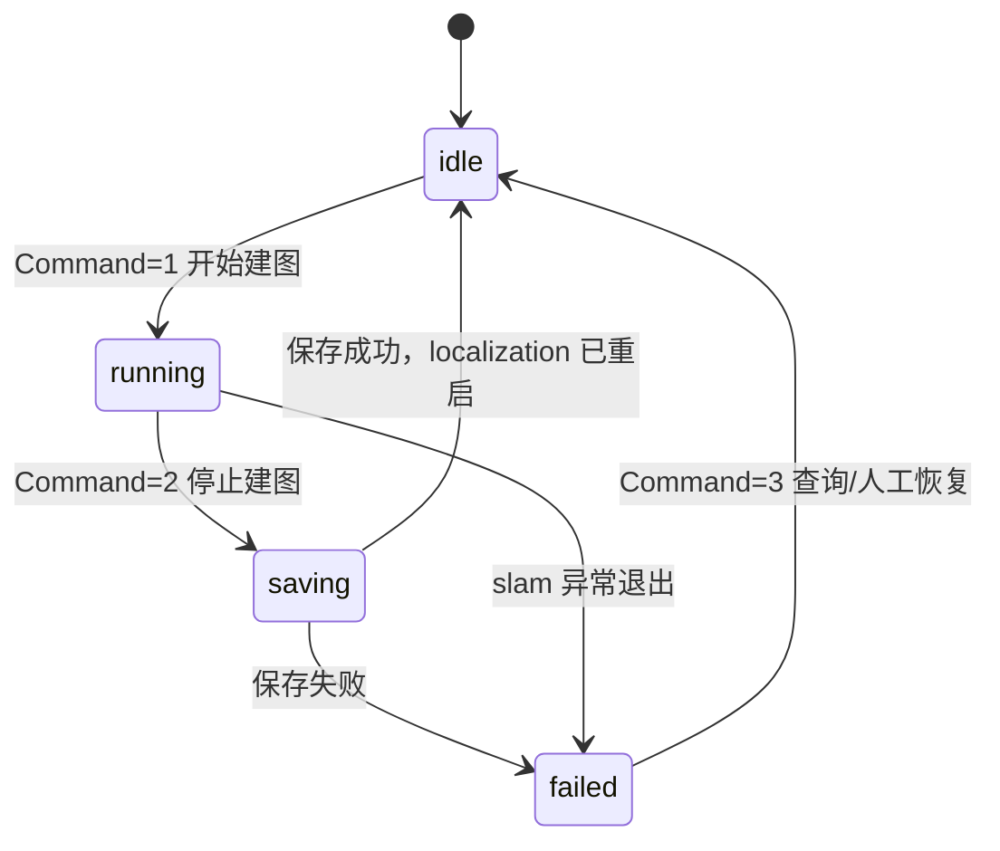
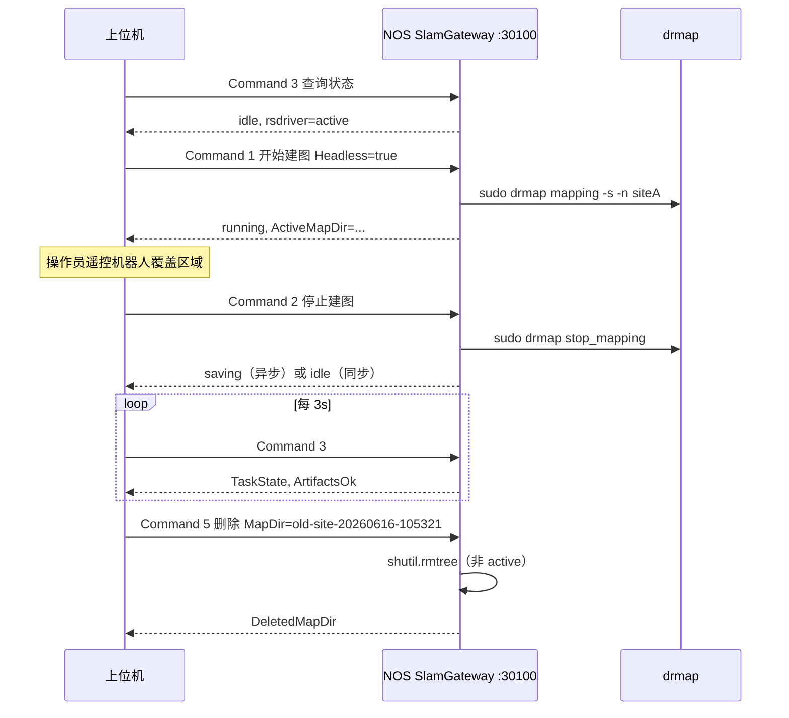

# 云深处 M20 Onboard 建图 UDP 网关协议（拟定稿）

> **状态**：拟定稿 v0.1.4（2026-06-26）  
> **目的**：将 NOS 上云深处自带 SLAM 建图能力（`drmap` / `mapping.service`）封装为 UDP 接口，供上位机远程启停建图、查询状态、切换/删除地图。  
> **适用设备**：M20 / M20 Pro 导航主机（NOS）  
> **底层实现**：`/usr/local/bin/drmap`（参见 [onboard_slam_nav_flow.md](onboard_slam_nav_flow.md)、`scripts/drmap_mapping.sh`）

---

## 1. 与现有协议的关系

| 协议 | 部署位置 | 默认地址 | 端口 | 职责 |
|------|----------|----------|------|------|
| 本体监控协议（PatrolDevice） | 运控板 | `10.21.31.103` | UDP `30000` / TCP `30001` | 运动、充电、§7.4 导航等 |
| **本协议（SlamGateway）** | **导航主机 NOS** | **`10.21.33.106`**（示例） | **UDP `30100`** | **建图 / 地图管理** |

设计原则：

- **报文帧格式**与 `m20_robot_monitoring_protocol.md` §3 **APDU 头部一致**（16 字节 + JSON ASDU），便于上位机复用编解码库。
- ASDU 根节点使用 **`SlamGateway`**（与 `PatrolDevice` 区分），避免与运控板 Type 冲突。
- 建图命令在 NOS 本地执行 `sudo drmap …`；**不**经运控板转发。

---

## 2. 通信基础

### 2.1 角色

| 角色 | 说明 |
|------|------|
| 上位机 | UDP 客户端，发起建图/地图管理请求 |
| NOS 网关 | UDP 服务端，监听 `30100`，调用 `drmap` / `systemctl` |

### 2.2 默认参数

| 项目 | 默认值 | 备注 |
|------|--------|------|
| 协议 | UDP | 仅 UDP；建图为长任务，靠状态轮询 |
| 服务端 IP | NOS 地址 | 示例 `10.21.33.106`，以现场为准 |
| 服务端端口 | `30100` | 可配置 |
| ASDU 格式 | JSON | `0x01` |
| 编码 | UTF-8 | |
| 单次请求超时（上位机） | `5 s` | 查询类 |
| 停止建图超时（上位机） | `180 s` | `stop_mapping` 可能较久 |
| 地图根目录 | `/var/opt/robot/data/maps/` | 固定；协议中 **不传绝对路径** |
| 报文 ID | 小端 `uint16` | 请求自增；响应沿用请求 ID |

**地图目录约定**：除 §5.1 开始建图请求中的 `MapName`（**名前缀**，对应 `drmap -n`）外，凡涉及已存在地图目录的字段（如 `ActiveMapDir`、`MapDir`、`DeletedMapDir`、`Maps[].MapDir`）均为 **目录名**（basename），不含父路径。网关内部拼完整路径：`/var/opt/robot/data/maps/<目录名>`。

### 2.3 APDU 结构

与 Patrol 协议相同：

```text
[0..3]   0xEB 0x91 0xEB 0x90
[4..5]   ASDU 长度（小端）
[6..7]   MsgId（小端）
[8]      ASDU 格式 0x01=JSON
[9..15]  保留 0x00
[16..]   ASDU JSON
```

### 2.4 ASDU 通用结构

```json
{
  "SlamGateway": {
    "Type": 2200,
    "Command": 1,
    "Time": "2026-06-15 14:00:00",
    "Items": {}
  }
}
```

### 2.5 通用响应 Items

所有响应在 `Items` 中 **至少** 包含：

| 字段 | 类型 | 说明 |
|------|------|------|
| `ErrorCode` | int | `0` 成功；非 0 见 §8 |
| `ErrorMessage` | string | 可读描述，失败时必填 |

长耗时操作额外返回：

| 字段 | 类型 | 说明 |
|------|------|------|
| `TaskState` | string | `idle` / `running` / `saving` / `failed` |
| `TaskId` | string | 可选，任务 UUID |

---

## 3. 建图状态机



| TaskState | 含义 | NOS 侧判定 |
|-----------|------|------------|
| `idle` | 未建图 | `mapping.service` inactive 且无 `slam_ddsnode` |
| `running` | 建图中 | `mapping.service` active 或 `slam_ddsnode` 存在 |
| `saving` | 正在保存 | 已收到 `stop_mapping`，尚未完成产物检查 |
| `failed` | 异常 | 上次操作失败或产物不完整 |

**并发约束**：同一时刻仅允许 **一个** 建图会话；`running` 或 `saving` 时再次 `开始建图` 返回 `0xB001`。

---

## 4. 接口总览

**Type 固定为 `2200`（SLAM 建图网关）**

| Command | 名称 | 方向 | 对应 drmap / 脚本 |
|--------:|------|------|-------------------|
| `1` | 开始建图 | 请求/响应 | `drmap mapping [opts]` |
| `2` | 停止建图并保存 | 请求/响应 | `drmap stop_mapping` |
| `3` | 查询建图/地图状态 | 请求/响应 | `drmap_mapping.sh status` |
| `4` | 切换导航地图 | 请求/响应 | `drmap apply <dir>` |
| `5` | 删除地图 | 请求/响应 | 删除 `/var/opt/robot/data/maps/<name>/` |
| `6` | 列出本地地图 | 请求/响应 | 扫描 `/var/opt/robot/data/maps/` |
| `7` | 取消建图（可选） | 请求/响应 | 等价 `stop_mapping` 或厂商扩展 |

**实现对齐说明**

- **NOS 下位机 UDP 网关**：`Command 1/2/3/4/5/6` 已实现
- **当前上位机前端接入**：`Command 1/2/3/4/6` 已接入；`Command 5 删除地图` 由下位机支持，但前端页面入口尚未暴露

---

## 5. 接口详细定义

### 5.1 开始建图 — Command `1`

**前置条件**

- 机器人 **静止站立**
- `rsdriver.service` **active**（onboard 雷达）
- **无**自研 `rslidar_sdk_node` 占用组播端口
- 当前 `TaskState` 为 `idle`

**请求 Items**

| 参数 | 类型 | 必填 | 默认 | 说明 |
|------|------|------|------|------|
| `MapName` | string | 否 | 自动生成 | **地图名前缀**（非目录名），对应 `drmap mapping -n` |
| `Headless` | bool | 否 | `true` | `true` → `-s` 不启 RViz（上位机远程推荐） |
| `Outdoor` | bool | 否 | `false` | `true` → `-o` 室外模式 |
| `ActivateAfterStop` | bool | 否 | `true` | `false` → `-b` 建完不立即用于导航 |
| `IndoorPreset` | bool | 否 | `true` | 保留；与 `Outdoor=false` 一致 |

**网关行为**

```bash
sudo drmap mapping [-n MapName] [-s] [-o] [-b]
```

**响应 Items（成功）**

| 字段 | 类型 | 说明 |
|------|------|------|
| `ErrorCode` | int | `0` |
| `TaskState` | string | `running` |
| `ActiveMapDir` | string | 新建地图目录名，如 `map-lab_floor1-20260615-140003` |

**JSON 请求示例**

```json
{
  "SlamGateway": {
    "Type": 2200,
    "Command": 1,
    "Time": "2026-06-15 14:00:00",
    "Items": {
      "MapName": "lab_floor1",
      "Headless": true,
      "Outdoor": false,
      "ActivateAfterStop": true
    }
  }
}
```

**JSON 响应示例**

```json
{
  "SlamGateway": {
    "Type": 2200,
    "Command": 1,
    "Time": "2026-06-15 14:00:03",
    "Items": {
      "ErrorCode": 0,
      "ErrorMessage": "ok",
      "TaskState": "running",
      "ActiveMapDir": "map-lab_floor1-20260615-140003"
    }
  }
}
```

---

### 5.2 停止建图并保存 — Command `2`

**前置条件**：`TaskState` 为 `running`（否则 `0xB002`）

**请求 Items**：空 `{}` 即可

**网关行为**

1. 将状态置为 `saving`
2. 执行 `sudo drmap stop_mapping`
3. 检查 `full_cloud.pcd`、`occ_grid.yaml`、`occ_grid.pgm`、`.blocks/`
4. 成功后 `TaskState` → `idle`，`localization` / `planner` 应已自动重启

**响应 Items（成功）**

| 字段 | 类型 | 说明 |
|------|------|------|
| `TaskState` | string | `idle` |
| `ActiveMapDir` | string | 保存后的地图目录名 |
| `Artifacts` | object | 产物摘要，见下 |

`Artifacts` 结构：

| 字段 | 类型 | 说明 |
|------|------|------|
| `FullCloudPcdBytes` | int | `full_cloud.pcd` 大小 |
| `OccGridReady` | bool | 栅格是否齐全 |
| `BlockChunkCount` | int | `.blocks/*.chunk` 数量 |
| `LocalizationActive` | bool | 停止后 localization 是否 active |

**注意**：`stop_mapping` 可能耗时 **30~120 s**；上位机应：

- 将 UDP 接收超时设为 **≥180 s**；或
- 采用 **异步模式**（见 §6.2）：立即返回 `TaskState=saving`，再轮询 Command `3`

---

### 5.3 查询建图/地图状态 — Command `3`

**请求 Items**

| 参数 | 类型 | 必填 | 说明 |
|------|------|------|------|
| `IncludeMapList` | bool | 否 | `true` 时附带最近 N 张地图摘要 |

**响应 Items**

| 字段 | 类型 | 说明 |
|------|------|------|
| `TaskState` | string | §3 状态机 |
| `MappingService` | string | `active` / `inactive` / `failed` |
| `LocalizationService` | string | 同上 |
| `RsdriverService` | string | 同上 |
| `ActiveMapDir` | string | 当前 active 地图目录名 |
| `ActiveMapName` | string | 可选，当前 active 地图显示名；上位机前端可优先读该字段 |
| `ArtifactsOk` | bool | 当前 active 地图产物是否完整 |
| `SlamProcess` | string | 可选，`slam_ddsnode` 进程摘要 |
| `Artifacts` | object | 可选，当前 active 地图产物摘要，格式同 §5.2 |
| `Maps` | array | `IncludeMapList=true` 时返回 |

`Maps[]` 元素：

| 字段 | 类型 | 说明 |
|------|------|------|
| `MapDir` | string | 地图目录名 |
| `Name` | string | 可选，地图显示名；若无独立显示名，可与 `MapDir` 相同 |
| `Path` | string | 可选，兼容字段；建议返回目录名 basename 或完整路径之一 |
| `IsActive` | bool | 是否为当前 active |
| `Mtime` | string | 目录修改时间 |
| `ArtifactsOk` | bool | 产物是否完整 |

---

### 5.4 切换导航地图 — Command `4`

**前置条件**：`TaskState` 为 `idle`（建图未进行中）

**请求 Items**

| 参数 | 类型 | 必填 | 说明 |
|------|------|------|------|
| `MapDir` | string | 否 | 推荐字段，地图目录名，如 `siteA-20260616-105321` |
| `MapName` | string | 否 | 兼容字段；当前上位机桥接允许传入，NOS 可解析为目录名或显示名 |

约束：`MapDir` 与 `MapName` **至少提供一个**；若两者同时存在，建议 NOS 优先按 `MapDir` 处理。

**网关行为**：`sudo drmap apply /var/opt/robot/data/maps/<MapDir>`

**响应 Items**：`ActiveMapDir`（目录名）、`ActiveMapName`（可选）、`LocalizationService` 重启结果

**当前上位机 HTTP 桥接**

- `POST /api/mapping/apply`
- JSON Body 示例：

```json
{
  "mapDir": "siteA-20260616-105321"
}
```

或：

```json
{
  "mapName": "siteA-20260616-105321"
}
```

---

### 5.5 删除地图 — Command `5`

> 当前 **NOS 下位机已实现**该命令；当前仓库中的上位机前端尚未提供 `/api/mapping/delete` HTTP 桥接与页面入口，但协议本身与下位机实现已具备删图能力。

**前置条件**

- `TaskState` 为 `idle`（非建图 / 保存中）
- **不可**删除当前 `active` 指向的地图
- 目标为 `/var/opt/robot/data/maps/` 下的地图目录

**请求 Items**

| 参数 | 类型 | 必填 | 说明 |
|------|------|------|------|
| `MapDir` | string | 是 | 地图目录名，如 `siteA-20260616-105321`；网关拼 `/var/opt/robot/data/maps/<MapDir>` |

**网关行为**：递归删除地图目录（`drmap` 无 delete 子命令，由网关执行 `shutil.rmtree`）

**响应 Items**

| 字段 | 类型 | 说明 |
|------|------|------|
| `DeletedMapDir` | string | 已删除的地图目录名 |

**常见错误**

| ErrorCode | 说明 |
|-----------|------|
| `0xB007` | 地图不存在 |
| `0xB008` | 建图 / 保存中 |
| `0xB00D` | 不可删除 active 地图 |
| `0xB00E` | 删除失败（权限 / 占用等） |

> 删除为**不可恢复**操作；若地图已同步至平台服务器，需另行在远端清理。

---

### 5.6 列出本地地图 — Command `6`

**请求 Items**

| 参数 | 类型 | 默认 | 说明 |
|------|------|------|------|
| `Limit` | int | `20` | 最多返回条数 |
| `SortBy` | string | `mtime_desc` | 排序方式 |

**响应 Items**：`Maps` 数组（格式同 §5.3）

**当前上位机 HTTP 桥接**

- `GET /api/mapping/maps`
- Query 参数：
  - `limit=<int>`
  - `sortBy=<string>`，默认 `mtime_desc`

示例：

```bash
curl "http://localhost:4174/api/mapping/maps?limit=20&sortBy=mtime_desc"
```

---

## 6. 交互模式

### 6.1 同步模式（简单）

```text
上位机                         NOS 网关
  |-- Command 1 开始建图 ------>|
  |<-- running -----------------|
  |   （遥控机器人扫描 5~30 min） |
  |-- Command 2 停止建图 ------>|
  |<-- idle + Artifacts --------|  （长超时 180s）
```

### 6.2 异步模式（推荐）

| 步骤 | 说明 |
|------|------|
| 1 | 发 Command `2`，网关 **立即** 响应 `TaskState=saving`、`ErrorCode=0` |
| 2 | 后台线程执行 `stop_mapping` |
| 3 | 上位机每 **2~5 s** 发 Command `3` 轮询 |
| 4 | 当 `TaskState=idle` 且 `ArtifactsOk=true`，建图流程结束 |

开始建图同理：若 `drmap mapping` 启动超过 3 s，可先返 `running`，由 Command `3` 确认 `slam_ddsnode` 已起来。

---

## 7. 典型时序（上位机联调）



---

## 8. 错误码

| ErrorCode | 名称 | 说明 |
|-----------|------|------|
| `0` | OK | 成功 |
| `0xB001` | MAPPING_ALREADY_RUNNING | 已有建图任务 |
| `0xB002` | NOT_MAPPING | 未在建图，无法 stop |
| `0xB003` | RSDRIVER_INACTIVE | 雷达未就绪 |
| `0xB004` | LIDAR_CONFLICT | 自研 rslidar_sdk 占用端口 |
| `0xB005` | DRMAP_FAILED | drmap 命令非零退出 |
| `0xB006` | ARTIFACTS_INCOMPLETE | 停止后产物不完整 |
| `0xB007` | MAP_NOT_FOUND | apply/list 指定地图不存在 |
| `0xB008` | NAV_STACK_BUSY | 建图/切换中 localization 状态不允许 |
| `0xB009` | SUDO_DENIED | 网关无 sudo 权限 |
| `0xB00A` | TIMEOUT | 内部操作超时 |
| `0xB00D` | MAP_IS_ACTIVE | 不可删除当前 active 地图 |
| `0xB00E` | DELETE_FAILED | 删除目录失败 |
| `0xB0FF` | INTERNAL_ERROR | 未分类错误 |

---

## 9. NOS 网关实现建议

本协议 **不修改** 云深处原厂 `drmap` 二进制，仅在 NOS 部署轻量 UDP 网关（建议路径：`~/m20_slam/scripts/mapping_udp_gateway.py`）。

### 9.1 进程要求

| 项目 | 建议 |
|------|------|
| 监听 | `0.0.0.0:30100` |
| 权限 | 以普通用户运行 + `sudoers` 允许无密码执行 `drmap` |
| 日志 | `~/m20_slam/logs/mapping_udp_gateway.log` |
| 开机自启 | `systemd` user service 或 `nohup`（可选） |
| 依赖 | 复用 `scripts/patrol_protocol.py` 的 APDU 编解码 |

### 9.2 sudoers 示例（NOS）

```text
# /etc/sudoers.d/m20-mapping-gateway
user ALL=(ALL) NOPASSWD: /usr/local/bin/drmap
```

### 9.3 drmap 参数映射表

| UDP Items | drmap 参数 |
|-----------|------------|
| `Headless=true` | `-s` |
| `Outdoor=true` | `-o` |
| `ActivateAfterStop=false` | `-b` |
| `MapName="xxx"` | `-n xxx` |

### 9.4 与现有脚本关系

| 组件 | 作用 |
|------|------|
| `scripts/drmap_mapping.sh` | 人工 SSH 建图；网关可内部调用同等逻辑 |
| `onboard_slam_nav_flow.md` | 架构与话题参考 |
| `m20_robot_monitoring_protocol.md` | APDU 帧格式参考 |

### 9.5 上下位机对齐情况

当前地图管理能力分为两层：

| 层级 | 组件 | 状态 |
|------|------|------|
| 下位机 NOS | `mapping_udp_gateway.py` / `test_mapping_udp_client.py` / `install_mapping_udp_gateway_service.sh` | `Command 1/2/3/4/5/6` 已实现 |
| 上位机前端 | `web-pcd-viewer/api/m20RobotProtocol.ts` | `Command 1/2/3/4/6` 已接入 |
| 上位机本地桥接 | `web-pcd-viewer/vite.config.ts` | `/api/mapping/start`、`/stop`、`/status`、`/maps`、`/apply` 已接入 |

这意味着：

- 通过 UDP 直连 NOS 时，开始/停止/查询/apply/list/delete 均可使用
- 通过当前 Web 前端页面时，开始/停止/查询/apply/list 已接入
- 若要在前端直接删图，只需补 `/api/mapping/delete` 桥接和页面入口，无需修改 NOS 协议

---

## 10. 安全与运维

| 项 | 说明 |
|----|------|
| 网络 | 建议仅允许上位机网段访问 NOS `30100/udp`（`iptables`） |
| 鉴权 | v0.1 无鉴权；v0.2 可在 Items 增加 `Token` |
| 建图冲突 | 建图期间 `localization` 停止，**禁止** 同时通过 Patrol §7.4 下发导航 |
| 回充 | 建图期间勿触发自动回充 |
| 失败恢复 | `TaskState=failed` 时人工 SSH 执行 `drmap_mapping.sh status` |

---

## 11. 上位机调用示例（伪代码）

```python
import socket
from patrol_protocol import build_apdu, parse_apdu  # 共用 APDU 层

sock = socket.socket(socket.AF_INET, socket.SOCK_DGRAM)
sock.settimeout(180.0)

def call(cmd: int, items: dict) -> dict:
    asdu = json.dumps({
        "SlamGateway": {
            "Type": 2200, "Command": cmd,
            "Time": now_str(), "Items": items,
        }
    }).encode()
    apdu, mid = build_apdu(asdu)
    sock.sendto(apdu, ("10.21.33.106", 30100))
    data, _ = sock.recvfrom(65535)
    return parse_response(data)

# 1. 查询
call(3, {"IncludeMapList": True})

# 2. 开始建图
call(1, {"MapName": "warehouse", "Headless": True})

# 3. …遥控扫描…

# 4. 停止
call(2, {})

# 5. 轮询直到 idle
while True:
    st = call(3, {})
    if st["Items"]["TaskState"] == "idle":
        break
    time.sleep(3)
```

---

## 12. 版本记录

| 版本 | 日期 | 说明 |
|------|------|------|
| v0.1 | 2026-06-15 | 初稿：Type=2200，Command 1~6，对齐 drmap 与 drmap_mapping.sh |
| v0.1.3 | 2026-06-26 | 地图目录字段统一为 basename；根目录固定 `/var/opt/robot/data/maps/` |
| v0.1.4 | 2026-06-26 | 对齐地图管理实现现状：NOS 已实现 Command 1~6；补充 ActiveMapName / Artifacts / Maps 扩展字段，apply/list 对齐当前上位机桥接 |

---

## 13. 实现状态与部署

| 组件 | 路径 | 状态 |
|------|------|------|
| UDP 网关 | `scripts/mapping_udp_gateway.py` | Command 1/2/3/4/5/6 已实现 |
| 测试客户端 | `scripts/test_mapping_udp_client.py` | 已实现 |
| 服务安装脚本 | `scripts/install_mapping_udp_gateway_service.sh` | 已实现 |
| 后台启动脚本 | `scripts/mapping_udp_gateway_start.sh` | 已实现 |
| 上位机前端协议封装 | `web-pcd-viewer/api/m20RobotProtocol.ts` | `Command 1/2/3/4/6` 已接入 |
| 上位机本地 HTTP 桥接 | `web-pcd-viewer/vite.config.ts` | `/api/mapping/start`、`/stop`、`/status`、`/maps`、`/apply` 已实现 |
| 删除地图 Command `5` 前端入口 | 当前上位机前端 | 待补 UI / HTTP 桥接，NOS 已实现 |

### NOS 部署

```bash
# drmap 无密码 sudo
echo 'user ALL=(ALL) NOPASSWD: /usr/local/bin/drmap' | sudo tee /etc/sudoers.d/m20-mapping-gateway

# 开机自启（systemd）
sudo ~/m20_slam/scripts/install_mapping_udp_gateway_service.sh

# 或仅手动后台
chmod +x ~/m20_slam/scripts/mapping_udp_gateway_start.sh
~/m20_slam/scripts/mapping_udp_gateway_start.sh start

python3 ~/m20_slam/scripts/test_mapping_udp_client.py status
```

### 典型联调

```bash
python3 ~/m20_slam/scripts/test_mapping_udp_client.py --host 10.21.33.106 status
python3 ~/m20_slam/scripts/test_mapping_udp_client.py --host 10.21.33.106 start --name siteA
python3 ~/m20_slam/scripts/test_mapping_udp_client.py --host 10.21.33.106 stop
python3 ~/m20_slam/scripts/test_mapping_udp_client.py --host 10.21.33.106 wait-idle
python3 ~/m20_slam/scripts/test_mapping_udp_client.py list
python3 ~/m20_slam/scripts/test_mapping_udp_client.py apply \
  --map-dir map-20260611-170905 --timeout 120
python3 ~/m20_slam/scripts/test_mapping_udp_client.py delete \
  --map-dir siteA-20260616-105321
```

### 待办

- [ ] NOS 防火墙放行 UDP 30100
- [ ] 上位机前端补 `/api/mapping/delete` 与删图 UI
- [ ] 实机回归：开始 → 扫描 → 停止 → apply → delete（非 active）
- [ ] 可选：建图进度经 Command 3 扩展
